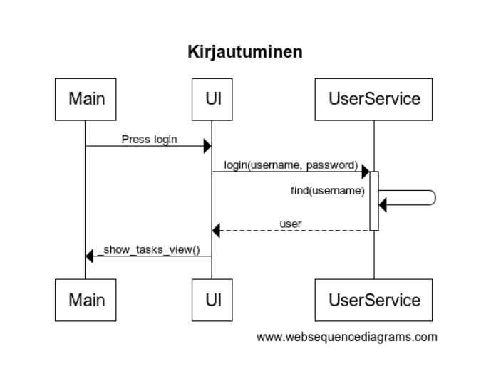
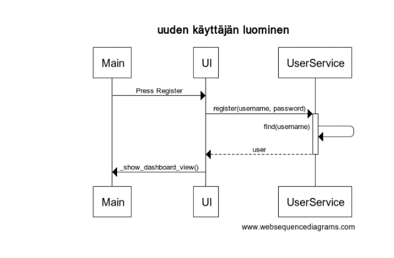
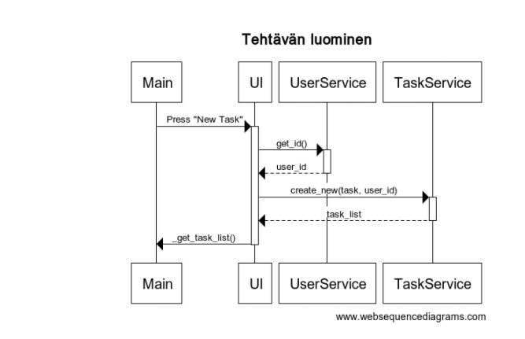
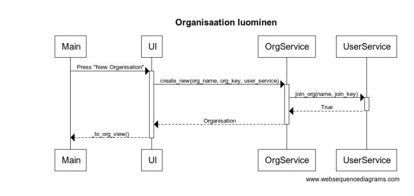

# Projektin arkkitehtuuri

## Yleinen rakenne sovelluksesta

## Päätoiminnallisuudet
### Kirjautuminen

Käyttäjä valitsee kirjautumisominaisuuden, jonka jälkeen täytetään lomakkeet ja klikataan Login.
Kun nappia on painettu, niin UI kutsuu UserServicen `login`-funktiota, jonka parametrina on käyttäjänimi ja salasana. Funktion sisällä tarkastetaan onko salasana oikein ja tällöin kirjautuminen onnistuu ja sovellus näyttää `DashboardView`-ikkunan

### Rekisteröityminen

Käyttäjä valitsee rekisteröitymisominaisuuden, jonka jälkeen täytetään lomakkeet ja klikataan Register.
Napin painamisen jälkeen UI kutsuu UserServicen `register`-funktiota, parametrinaan käyttäjänimi ja salasana. Funktiossa tarkastetaan onko käyttäjätunnuksen ja salasanan pituus yli 3 merkkiä. Katsotaan myös onko käyttäjänimi jo olemassa ja mikäli ei ole niin käyttäjä luodaan. Tämän jälkeen käyttäjälle näytetään `DashboardView`-ikkuna.

### Tehtävien luominen

Kun käyttäjä on tehtävät-sivulla, ja syöttää tehtävän lomakkeesseen ja painaa "New task"-nappia niin UI ensiksi hakee käyttäjän id:n ja lähettää kutsun TaskServicen `create_new`-funktiolle parametrinaan tehtävä ja käyttäjän id. Tämän jälkeen sovellus palauttaa listan käyttäjän tehtävistä ja renderöi ne TaskView-ikkunassa

### Organisaation luominen

Käyttäjä menee organisaation luonti -sivulle ja siellä antaa nimen sekä salasanan. Napin painettuaan sovellus kutsuu OrgService-luokan `create_new`-funktiota, jonka parametreina on organisaation nimi, organisaation salasana ja userService-luokka. Funktio tarkistaa onko olemassa semmoista nimeä ja mikäli ei ole niin kutsuu UserServicen `join_org`-funktiota, jossa muokataan käyttäjän tietokantaa ja vaihdetaan siihen organisaation nimi.

Tämän jälkeen käyttäjälle näytetään organisaation ikkuna. 
