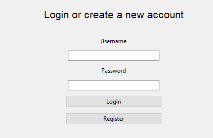
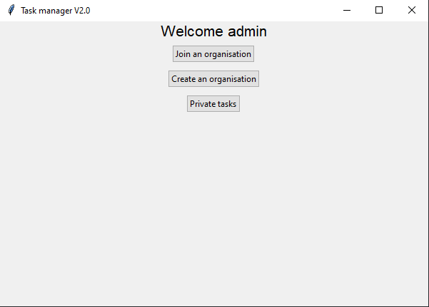
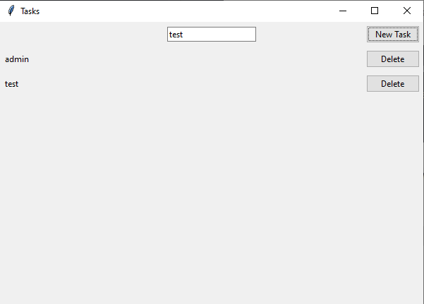
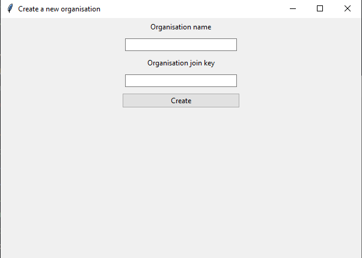
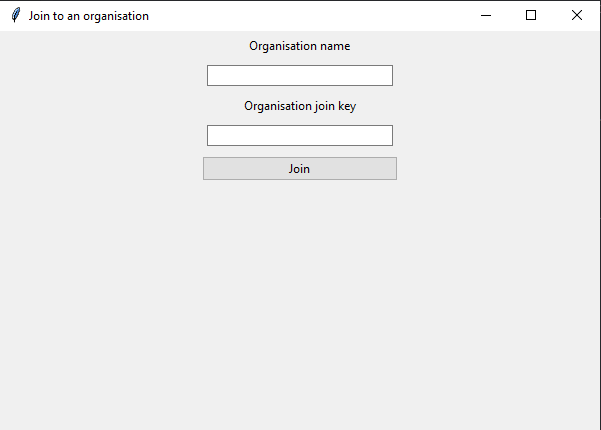
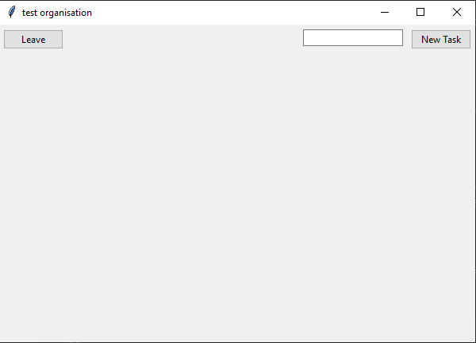

# Käyttöohje

Saat sovelluksen lataamalla uusimman julkaisun tai sitten kopioimalla repositoryn.

## Asentaminen
Tietokantojen sijainti on määritelty tiedostossa [config.py](/src/config.py)

Jos haluat muuttaa niitä, niin vaihda muuttujien `DATABASE_PATH` ja `TESTING_DATABASE_PATH`

### Käynnistämien
Asenna tarvittavat kirjastot
```
$ poetry install
```

Alusta tietokanta
```
$ poetry run invoke build
```

Käynnistä sovellus
```
$ poetry run invoke start
```


## Kirjautuminen ja Rekisteröinti


Syötä omat tunnukset kenttiin.
Jos haluat kirjautua, paina `Login`

Jos haluat rekisteröityä, paina `Register`

## Omat tehtävät


Kun haluat luoda yksityisiä tehtäviä, paina `Private tasks`



Näkymässä, syötä tehtävä kenttään ja paina `New task`. Voit poistaa tehtävän painamalla nappia `Delete`.

Jos haluat vaihtaa organisaation näkymään, sulje sovellus ja kirjaudu uudelleen. 

## Organisaatioon liittyminen ja luominen


Kun haluat liittyä organisaatioon, paina `Create an organisation`.



Syötä kenttiin haluamasi organisaation nimi sekä muille käyttäjille annettava avain, joilla he pääsevät liittymään. Sen jälkeen paina nappia `Create`



Syötä organisaation nimi, mihin haluat liittyä sekä kyseisen organisaation avain. Sen jälkeen paina nappia `Join`

## Organisaation tehtävät


Syötä kenttään tehtävä ja paina nappia `New Task`. Jos haluat lähteä organisaatiosta, paina nappia `Leave`.

