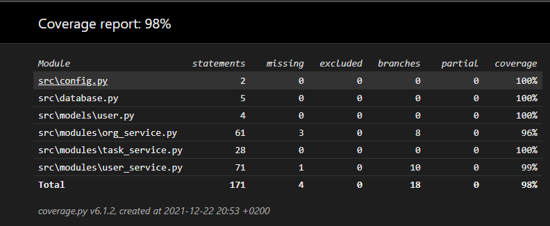

# Testaaminen

Testaaminen toimii simppelisti, eli jokaiselle `modules`-kansiossa olevalle servicelle on luotu omat testinsä. Jotta testit eivät sekaannu pääsovelluksen tietokannan kanssa niin sitä varten on tehty `test_data.db`-tiedosto. Sen saa aktivoitua syöttämällä servicelle `True`-parametri.

Testit voi ajaa seuraavalla komennolla.
```
$ poetry run invoke test
```

### Testauskattavuus
Testauskattavuuden pitäisi olla sovellukselle noin 98%


Sen saa luotua komennolla
```
$ poetry run invoke coverage-report
```